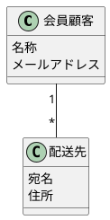

# レッスン3
## 回答

- ある会員顧客は、配送先を0個以上持てる
- ある配送先は必ず1つの会員顧客に対応する

## ポイント
基本の多重度
- 1：きっかり1
- 0..1：0または1
- *：0以上
- 1..*：1以上

注意すべきこと
- **相手側**から見ていくつの要素と結び付くかを指定すること
    - 会員顧客側の1は、配送先が必ず1つの会員顧客と結び付くことを表す
    - 配送先側の*は、会員顧客が0以上の配送先と結び付くことを表す

典型的な関連の多重度の呼び方
- 一方が1で他方が多：1対多
- 両方が多：多対多
- 0..1の多重度：オプショナル
