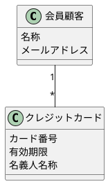
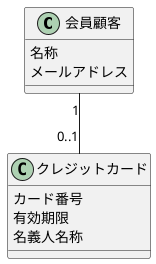

# レッスン4
## 回答


## 正解


うーん……個人的には「クレジットカード情報を1枚登録することで、クレジットカードでの決済が可能になる」という一文から、クレジットカード情報は**1枚分だけしか登録できない**とは言い切れないと思うので納得感が薄い。

## ポイント
- 実際には同じものであっても、情報の重複を許容できる場合には別のインスタンスとして表現する
    - この場合だとあるクレジットカードを複数の顧客が使い回す（家族同士だとあり得る）ことを許容するということになる
- 以下のように、関連名とロール名を指定することで関連の意味を明示できる
  無くてもモデルが表現する内容を読み取れる場合は書かなくて良い
    ```puml
    @startuml
    class 会員顧客 {
        名称
        メールアドレス
    }
    note right of 会員顧客 : 利用者

    class クレジットカード {
        カード番号
        有効期限
        名義人名称
    }

    会員顧客 "1" -- "0..1" クレジットカード : 登録する
    @enduml
    ```