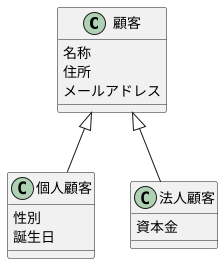

# レッスン1
## 回答

```puml
@startuml
class 顧客 {
    名称
    住所
    メールアドレス
}

class 個人顧客 {
    性別
    誕生日
}

class 法人顧客 {
    資本金
}

顧客 <|-- 個人顧客
顧客 <|-- 法人顧客
@enduml
```

## ポイント
- これは継承なので、顧客の持つ属性と関連は個人顧客と法人顧客にも自動的に定義される