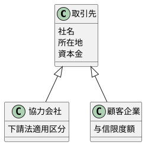
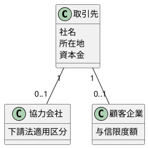

# レッスン7
## 回答

```puml
@startuml
class 取引先 {
    社名
    所在地
    資本金
}

class 協力会社 {
    下請法適用区分
}

class 顧客企業 {
    与信限度額
}

取引先 <|-- 協力会社
取引先 <|-- 顧客企業
@enduml
```

これではある取引先が協力会社と顧客企業の両方になることができないので、不適切である。

## 正解

```puml
@startuml
class 取引先 {
    社名
    所在地
    資本金
}

class 協力会社 {
    下請法適用区分
}

class 顧客企業 {
    与信限度額
}

取引先 "1" -- "0..1" 協力会社
取引先 "1" -- "0..1" 顧客企業
@enduml
```

## ポイント
- これは実体から役割を切り出して表現するパターンである
- パターンの使い分け
    - 「全体集合と部分集合」は部分集合の積集合に要素が存在しない場合に適用できる
    - 部分集合の積集合に要素が存在する場合は「実体と役割」を適用する