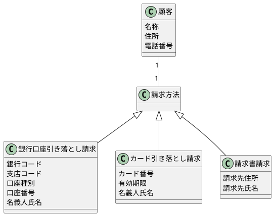

# レッスン8
## 回答

```puml
@startuml
class 顧客 {
    名称
    住所
    電話番号
}

class 請求方法 {

}

class 銀行口座引き落とし請求 {
    銀行コード
    支店コード
    口座種別
    口座番号
    名義人氏名
}

class カード引き落とし請求 {
    カード番号
    有効期限
    名義人氏名
}

class 請求書請求 {
    請求先住所
    請求先氏名
}

顧客 "1" -- "1" 請求方法
請求方法 <|-- 銀行口座引き落とし請求
請求方法 <|-- カード引き落とし請求
請求方法 <|-- 請求書請求
@enduml
```

## ポイント
このように、実体が時間の経過によって変化する役割を持つ時は、変化する部分を役割として実体から切り出す表現方法が使える。

```puml
実体 "1" -- "1" 役割
役割 <|-- 役割1
役割 <|-- 役割2
```