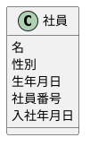
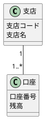
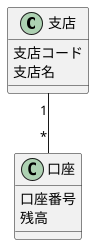
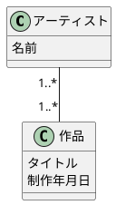
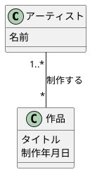
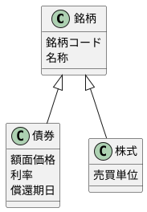

# 2章の腕試し
## 2-1
### 回答

## 2-2
### 回答

### 回答

## 2-3
### 回答

### 正解

## 2-4
### 回答

正解と違う所があったが、多重度が0以上か1以上かの違い……。コラムで、多重度で0以上か1以上か迷ったら0以上にしておくと書いてあったので、こんな感じなのかな。
実際は対象に合わせて決められれば良いので、あまり気にしないでおこう。
