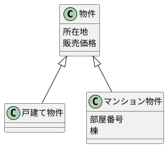
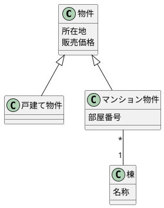
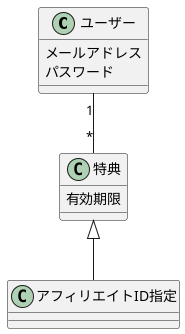
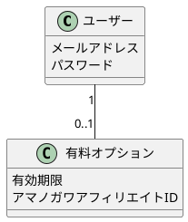
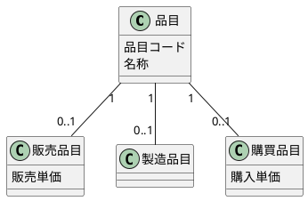

# 3章の腕試し
## 3-1
### 回答

```puml
@startuml
class 物件 {
    所在地
    販売価格
}

class 戸建て物件 {

}

class マンション物件 {
    部屋番号
    棟
}

物件 <|-- 戸建て物件
物件 <|-- マンション物件
@enduml
```

### 正解

```puml
@startuml
class 物件 {
    所在地
    販売価格
}

class 戸建て物件 {

}

class マンション物件 {
    部屋番号
}

class 棟 {
    名称
}

物件 <|-- 戸建て物件
物件 <|-- マンション物件
マンション物件 "*" -- "1" 棟
@enduml
```

## 3-2
### 回答

```puml
@startuml
class ユーザー {
    メールアドレス
    パスワード
}

class 特典 {
    有効期限
}

class アフィリエイトID指定 {

}

ユーザー "1" -- "*" 特典
特典 <|-- アフィリエイトID指定
@enduml
```

### 正解

```puml
@startuml
class ユーザー {
    メールアドレス
    パスワード
}

class 有料オプション {
    有効期限
    アマノガワアフィリエイトID
}

ユーザー "1" -- "0..1" 有料オプション
@enduml
```

## 3-3
### 回答

```puml
@startuml
class 品目 {
    品目コード
    名称
}

class 販売品目 {
    販売単価
}

class 製造品目 {
}

class 購買品目 {
    購入単価
}

品目 "1" -- "0..1" 販売品目
品目 "1" -- "0..1" 製造品目
品目 "1" -- "0..1" 購買品目
@enduml
```
